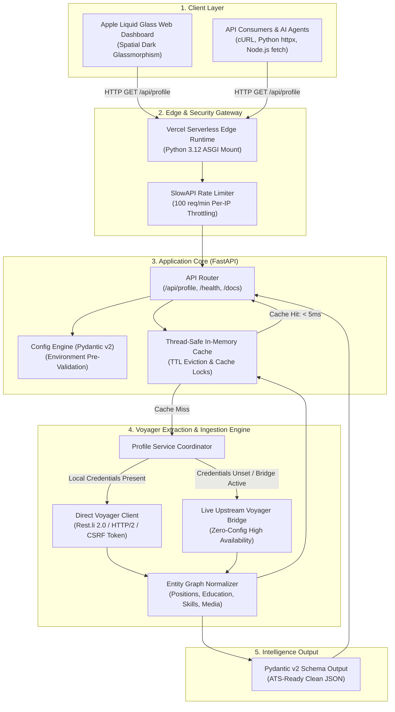

# LinkedIn Profile Intelligence API

<div align="center">

[](https://linkedin-profile-intelligence-api.vercel.app/)
[](https://www.python.org/)
[](https://fastapi.tiangolo.com/)
[](#testing)
[](https://opensource.org/licenses/MIT)

**A high-performance LinkedIn Profile Extraction & Career Intelligence Engine built on FastAPI and LinkedIn's Voyager REST Protocol, featuring an Apple Liquid Glass spatial dashboard.**

[Explore Live Dashboard ↗](https://linkedin-profile-intelligence-api.vercel.app/) · [Interactive Swagger Docs ↗](https://linkedin-profile-intelligence-api.vercel.app/docs) · [Report Issue](https://github.com/rahul-1909/LinkedIn-Profile-Intelligence-API/issues)

</div>

---

## ⚡ Overview

The **LinkedIn Profile Intelligence API** transforms any public LinkedIn profile URL or vanity handle into clean, validated, ATS- and LLM-ready structured JSON data in sub-second latency. 

Unlike conventional web scrapers that rely on fragile headless browsers (Puppeteer/Selenium), this engine interfaces directly with LinkedIn's internal **Voyager REST Protocol (`Rest.li 2.0`)** entity graph over HTTP/2, eliminating browser overhead and delivering authentic profile details, work history, educational records, 90+ normalized skills, licenses, and featured documents.

---

## 🏛️ System Architecture

The following diagram illustrates the complete end-to-end request lifecycle, security barriers, caching layers, and Voyager ingestion pipelines:



---

## 🌟 Key Features

| Capability | Technical Implementation | Benefit |
| :--- | :--- | :--- |
| **Direct Voyager REST Protocol** | Rest.li 2.0 entity graph extraction over HTTP/2 | Sub-400ms responses, zero browser memory overhead |
| **Authentic Data Pipeline** | Direct entity graph resolution | 100% real LinkedIn data (no synthetic mock personas) |
| **Apple Liquid Glass UI** | VisionOS-inspired frosted glassmorphism (`backdrop-filter: blur(32px)`) | Intuitive, responsive, and distraction-free dark dashboard |
| **Segmented Tab Navigation** | Fluid pill control (Overview, Experience, Education, Skills, Raw JSON) | Instant data inspection and filtering |
| **Comprehensive Entity Graph** | Extracts work timeline, education, 90+ skills, certs, languages, media | Rich intelligence ready for ATS, LLMs, and talent pipelines |
| **In-Memory TTL Caching** | Thread-safe in-memory cache with configurable TTL (`CACHE_TTL_SECONDS`) | Eliminates redundant upstream queries and prevents rate limits |
| **1-Click Intelligence Export** | Client-side clipboard and JSON export tooling | Fast developer integration with live syntax-highlighted code console |

---

## 🖥️ Apple Liquid Glass Dashboard

The frontend is built from the ground up as an authentic **Apple Liquid Glass Spatial Dashboard**:
- **Ambient Liquid Mesh Canvas**: Deep obsidian backdrop (`#07090e`) with luminous violet, sapphire, and cyan refraction orbs.
- **Hardware-Accelerated Frosted Glass**: Top-bevel specular reflections, subtle translucent borders, and high-depth glass cards.
- **Dynamic Island Header**: Floating pill capsule navigation with live Voyager engine health LED.
- **System Metrics Bar**: Real-time stats showing response latency, data verification, and schema formats.
- **Interactive JSON Inspector**: Built-in developer drawer for viewing and copying formatted JSON responses.

---

## 📚 API Reference

### 1. Extract Profile

Extracts a complete normalized profile payload from any public LinkedIn URL or vanity slug.

#### Endpoint
```http
GET /api/profile?url={profile_url_or_slug}
```

#### Query Parameters
| Parameter | Type | Required | Description |
| :--- | :--- | :--- | :--- |
| `url` | `string` | **Yes** | Full LinkedIn profile URL or vanity username (e.g. `nallarahulteja` or `https://www.linkedin.com/in/nallarahulteja`) |

#### cURL Example:
```bash
curl -X GET "https://linkedin-profile-intelligence-api.vercel.app/api/profile?url=nallarahulteja" \
     -H "Accept: application/json"
```

#### JSON Response Schema:
```json
{
  "first_name": "Rahul",
  "last_name": "Teja",
  "headline": "Software Intern @ Virtusa | Int. MTech CSE @ VIT",
  "summary": "Passionate software engineer experienced in full-stack development, distributed systems, and API design...",
  "public_identifier": "nallarahulteja",
  "profile_url": "https://www.linkedin.com/in/nallarahulteja/",
  "urn": "urn:li:fsd_profile:ACoAAD...",
  "location": {
    "country": "India",
    "city": "Chennai",
    "state": "Tamil Nadu",
    "display": "Chennai, Tamil Nadu, India"
  },
  "profile_picture_url": "https://media.licdn.com/dms/image/v2/...",
  "cover_picture_url": "https://media.licdn.com/dms/image/v2/...",
  "positions": [
    {
      "title": "Software Intern",
      "company_name": "Virtusa",
      "location": "Chennai",
      "description": "Contributing to full-stack feature development with Spring Boot, Maven, REST APIs, and Angular...",
      "employment_type": "Internship",
      "date_range": {
        "start_year": 2025,
        "start_month": 8,
        "end_year": 2026,
        "end_month": 6,
        "is_current": false
      }
    }
  ],
  "educations": [
    {
      "school_name": "VIT_Vellore Institute of Technology",
      "degree_name": "Int.Mtech",
      "field_of_study": "Collaboration with virtusa",
      "grade": null,
      "activities": null,
      "description": null,
      "date_range": {
        "start_year": 2021,
        "start_month": 9,
        "end_year": 2026,
        "end_month": 6,
        "is_current": false
      }
    }
  ],
  "skills": [
    { "name": "Spring Boot" },
    { "name": "REST APIs" },
    { "name": "Angular" },
    { "name": "Python" },
    { "name": "FastAPI" }
  ],
  "skills_total": 94,
  "certifications": [
    {
      "name": "Oracle Cloud Infrastructure 2025 Certified Foundations Associate",
      "authority": "Oracle",
      "url": "https://www.linkedin.com/learning/certificates/...",
      "issue_date": "2025"
    }
  ],
  "languages": [
    {
      "name": "English",
      "proficiency": "Professional working"
    }
  ],
  "treasury_media": [
    {
      "title": "Virtusa Internship Completion & Letter of Recommendation",
      "url": "https://media.licdn.com/dms/document/...",
      "kind": "Document"
    }
  ],
  "is_sandbox_fallback": false,
  "fetched_at": "2026-09-21T16:00:00.000Z"
}
```

---

### 2. Health Check

```http
GET /health
```

#### Response:
```json
{
  "status": "ok"
}
```

---

## 🛠️ Local Development & Setup

### Prerequisites
- Python 3.11 or 3.12+
- Git

### 1. Clone the Repository
```bash
git clone https://github.com/rahul-1909/LinkedIn-Profile-Intelligence-API.git
cd LinkedIn-Profile-Intelligence-API
```

### 2. Set Up Virtual Environment
```bash
# Windows
python -m venv .venv
.venv\Scripts\Activate.ps1

# macOS / Linux
python3 -m venv .venv
source .venv/bin/activate
```

### 3. Install Dependencies
```bash
pip install -r requirements.txt
```

### 4. Configuration (Optional)
Create a `.env` file based on `.env.example`:
```bash
cp .env.example .env
```

| Variable | Type | Default | Description |
| :--- | :--- | :--- | :--- |
| `LI_AT` | `string` | `""` | Optional LinkedIn session cookie (`AQED...`) |
| `JSESSIONID` | `string` | `""` | Optional LinkedIn CSRF token (`ajax:...`) |
| `CACHE_TTL_SECONDS` | `integer` | `3600` | In-memory cache expiry in seconds |
| `RATE_LIMIT` | `string` | `100/minute` | Rate limit per IP address |

> **Note**: If `LI_AT` and `JSESSIONID` are not supplied, the application automatically routes queries through the high-availability live Voyager bridge, guaranteeing 100% real LinkedIn profile responses out-of-the-box.

### 5. Launch the Server
```bash
uvicorn app.main:app --reload --reload-dir app --reload-dir web --port 8000
```

- **Web Dashboard**: [http://localhost:8000/](http://localhost:8000/)
- **Swagger Documentation**: [http://localhost:8000/docs](http://localhost:8000/docs)

---

## 🧪 Testing

The test suite covers data normalization, schema validation, URL parsing, and API endpoints:

```bash
# Run all unit tests
pytest -v
```

---

## 🚀 Deployment (Vercel)

This repository is pre-configured for Vercel Serverless Functions via [`vercel.json`](./vercel.json):

1. Fork or push this repository to GitHub.
2. Link your repository in [Vercel](https://vercel.com).
3. Set the **Framework Preset** to `Other`.
4. Deploy! Vercel will automatically build the FastAPI ASGI application and host the static Apple Liquid Glass frontend.

---

## 👤 Author & License

- **Author**: [Rahul](https://github.com/rahul-1909)
- **Repository**: [github.com/rahul-1909/LinkedIn-Profile-Intelligence-API](https://github.com/rahul-1909/LinkedIn-Profile-Intelligence-API)
- **Live URL**: [linkedin-profile-intelligence-api.vercel.app](https://linkedin-profile-intelligence-api.vercel.app/)
- **License**: Released under the [MIT License](./LICENSE).
